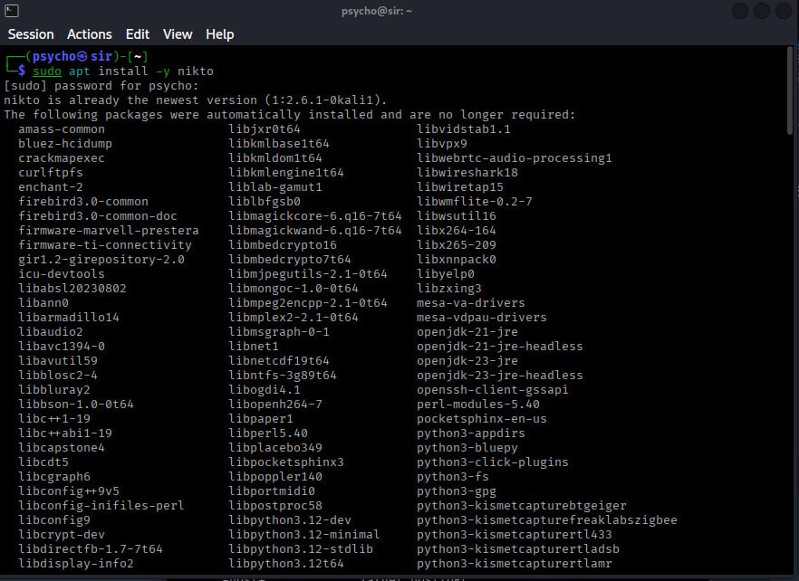
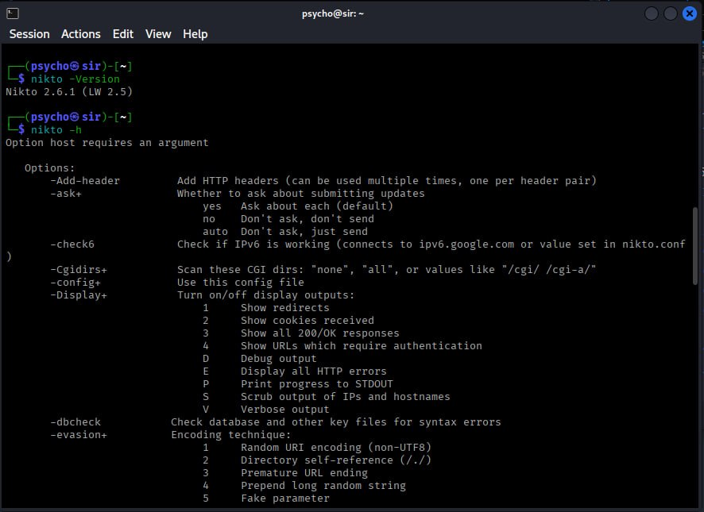
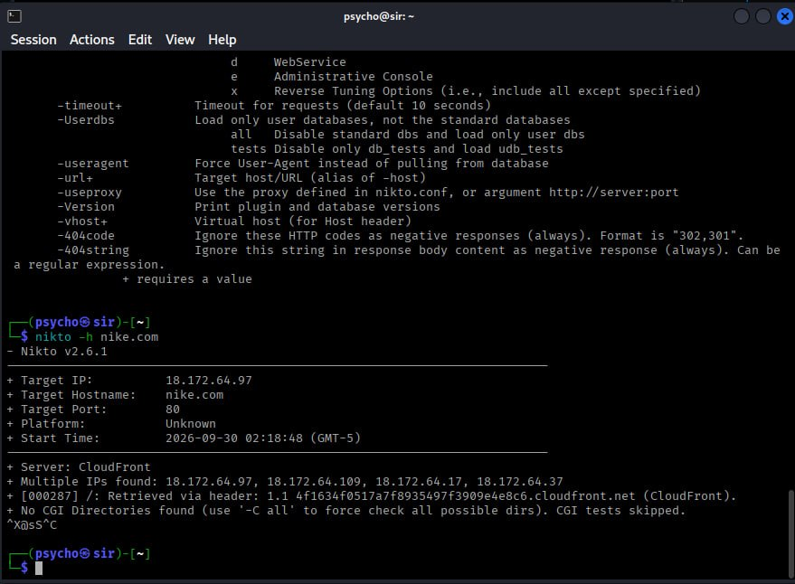

<div align="center">

# 🔎 Nikto Web Server Security Assessment

### Web Server Scanning & Security Testing with Kali Linux


</div>

---

## 🧭 Overview

This project demonstrates the use of **Nikto** for basic web server security assessment in a Kali Linux environment.

Nikto is an open-source web server scanner that checks for potentially interesting files, outdated server components, insecure configurations, and other commonly known issues.

The project documents the complete learning workflow:

```text
Installation
     ↓
Version Verification
     ↓
Command & Options
     ↓
Authorized Web Server Scan
     ↓
Result Analysis
```

> ⚠️ **Ethical Use:** Perform security testing only against systems you own or have explicit authorization to assess.

---

## 🎯 Objectives

- Install Nikto on Kali Linux
- Verify the Nikto installation
- Learn essential Nikto options
- Understand web server scanning
- Perform a basic authorized scan
- Read and interpret scan output
- Understand the limitations of automated scanners
- Practice documenting security testing results

---

## 🛠️ Tools & Technologies

| Tool | Purpose |
|---|---|
| 🐉 Kali Linux | Security testing environment |
| 🔎 Nikto | Web server scanner |
| 💻 Terminal | Command-line interface |
| 🌐 HTTP/HTTPS | Web protocols |

---

# 🧪 Practical Walkthrough

## 01 — Nikto Installation

### Command

```bash
sudo apt update
sudo apt install -y nikto
```

### What it does

This command updates the package information and installs Nikto on Kali Linux.

### 📸 Terminal Evidence



---

## 02 — Verify Installation

After installation, verify the installed Nikto version.

### Command

```bash
nikto -Version
```

### Example Output

```text
Nikto 2.6.1 (LW 2.5)
```

### Explanation

This command displays the installed Nikto version and confirms that Nikto is available on the system.

### 📸 Terminal Evidence



---

## 03 — Explore Nikto Options

### Command

```bash
nikto -h
```

This displays Nikto's available command-line options.

### Common Options

| Option | Description |
|---|---|
| `-h` | Specify host / display help |
| `-Version` | Display Nikto version |
| `-url` | Specify target URL |
| `-p` | Specify target port |
| `-ssl` | Force SSL mode |
| `-output` | Save scan results |

---

## 04 — Basic Authorized Scan

For a system that you own or have explicit permission to test:

### HTTP

```bash
nikto -h http://TARGET
```

### HTTPS

```bash
nikto -h https://TARGET
```

Replace `TARGET` with the hostname or IP address of your authorized lab server.

---

# 📸 Scan Evidence

The following screenshot shows example Nikto scan output, including target information and server response details.



---

# 📊 Understanding the Output

Nikto may display information such as:

- Target IP address
- Target hostname
- Target port
- Web server information
- HTTP response information
- Multiple IP addresses
- CGI directory information
- Potentially interesting findings

### Example

```text
+ Target IP:        ...
+ Target Hostname:  ...
+ Target Port:      80
+ Platform:         Unknown
+ Server:           ...
```

> **Important:** A scanner finding does not automatically mean that a confirmed vulnerability exists. Findings should be manually verified.

---

# 🔬 Security Assessment Workflow

```text
        Target
          │
          ▼
     Nikto Scanner
          │
          ▼
   Automated Checks
          │
          ▼
 Potential Findings
          │
          ▼
 Manual Verification
          │
          ▼
 Security Analysis
          │
          ▼
      Final Report
```

Automated scanners assist with discovery, but security professionals still need to validate and understand the results.

---

# 🧠 Key Learning

Through this practical, I learned how to:

- Install Nikto on Kali Linux
- Verify the installation
- Use Nikto's help menu
- Understand common scanning options
- Perform basic authorized web-server assessment
- Read scanner output
- Document security-testing evidence
- Distinguish scanner findings from confirmed vulnerabilities

---

# 🛡️ Scope & Authorization

| Activity | Environment | Authorization |
|---|---|---|
| Nikto Installation | Local Kali Linux | Own system |
| Command Testing | Local environment | Own system |
| Web Server Assessment | Authorized lab/test target | Explicit permission required |

> 🔐 **Only scan systems that you own or have explicit permission to test.**

---

# 📁 Project Structure

```text
nikto-web-server-scan/
│
├── README.md
│
├── 1000521170.jpg
├── 1000521171.jpg
└── 1000521172.jpg
```

---

# 📸 Screenshots Gallery

<details>
<summary>Click to expand screenshots</summary>

### Installation


---

### Version & Help


---

### Scan Output


</details>

---

# ⚠️ Responsible Use

This repository is intended for **educational cybersecurity learning and authorized security testing**.

Nikto should only be used against:

- Your own websites
- Your own servers
- Local test environments
- CTF/lab environments
- Systems for which you have explicit written authorization

Unauthorized scanning can violate laws, organizational policies, or terms of service.

---

# 🚀 Future Improvements

Possible future additions to this project:

- [ ] Add a controlled local web server lab
- [ ] Document HTTPS testing
- [ ] Save Nikto results to a report
- [ ] Compare automated findings with manual verification
- [ ] Add additional web security testing tools
- [ ] Create a complete penetration-testing report

---

# 👨‍💻 Author

<div align="center">

## PsychoMods

**Cybersecurity • Security Research • Technology**

Learning by building, testing and documenting.

⭐ **Cybersecurity Learning Project**

</div>

---

<div align="center">

**🔐 Learn • Test • Verify • Secure**

</div>
